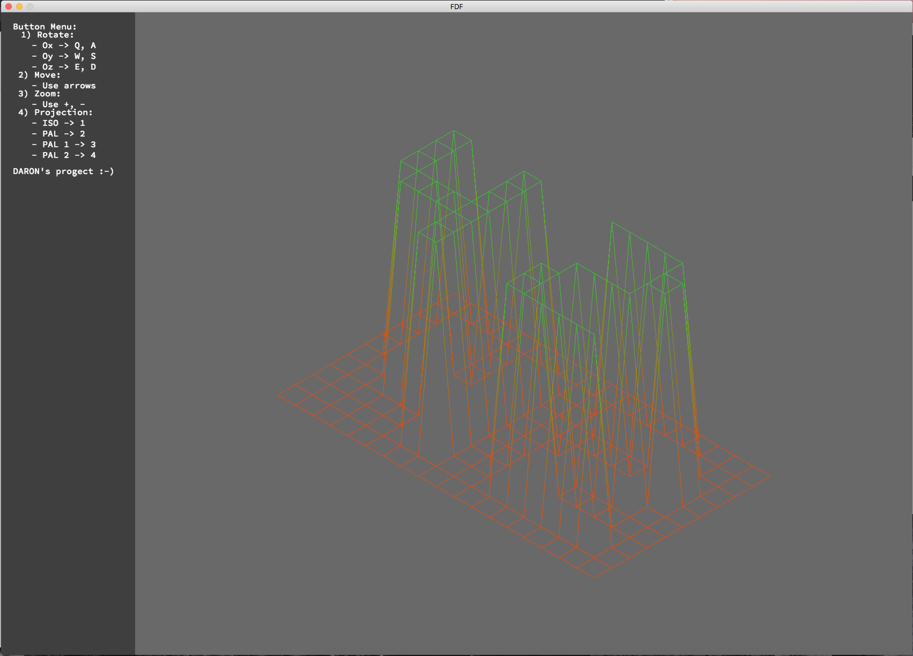
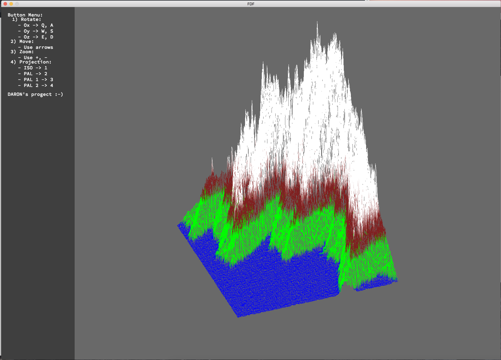
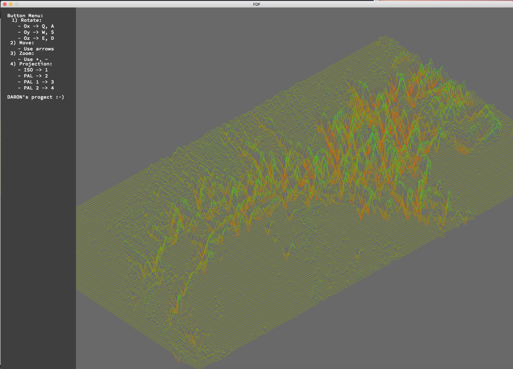

FdF
---------------------------------------------

A simple 3D height-map renderer. You can rotate models, color is defined by
relative height in the map. More features planned!

## Features
- Simple file format definition (array of space-separated integers)
- Camera controls (zoom, translate)
- Pretty color gradients!

## Compiling and running
Run `make`. An executable will compile. Currently only tested on OS X.

Run it with `./fdf [map]`. A bunch of sample maps are provided in the `maps`
directory. The one in the screenshot above is `maps/42.fdf`.

## Examples

