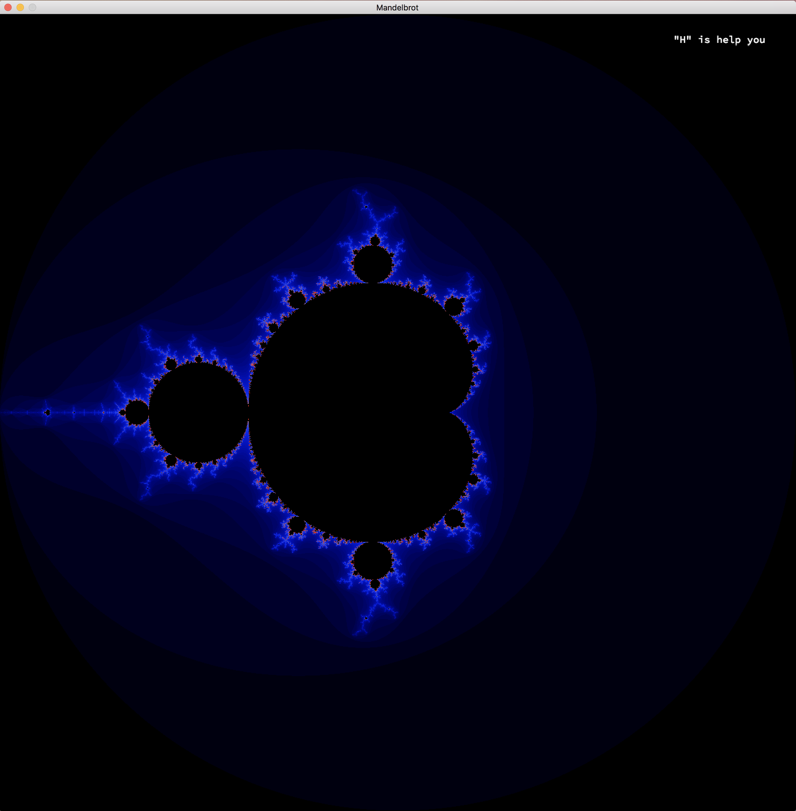
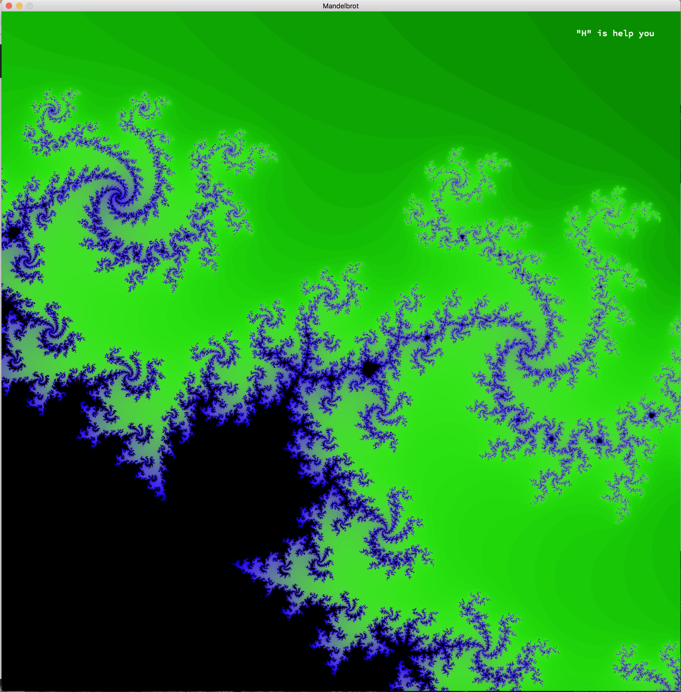
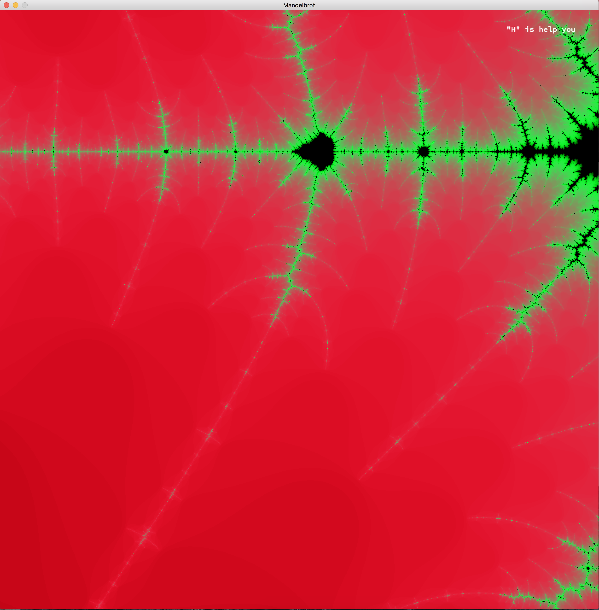
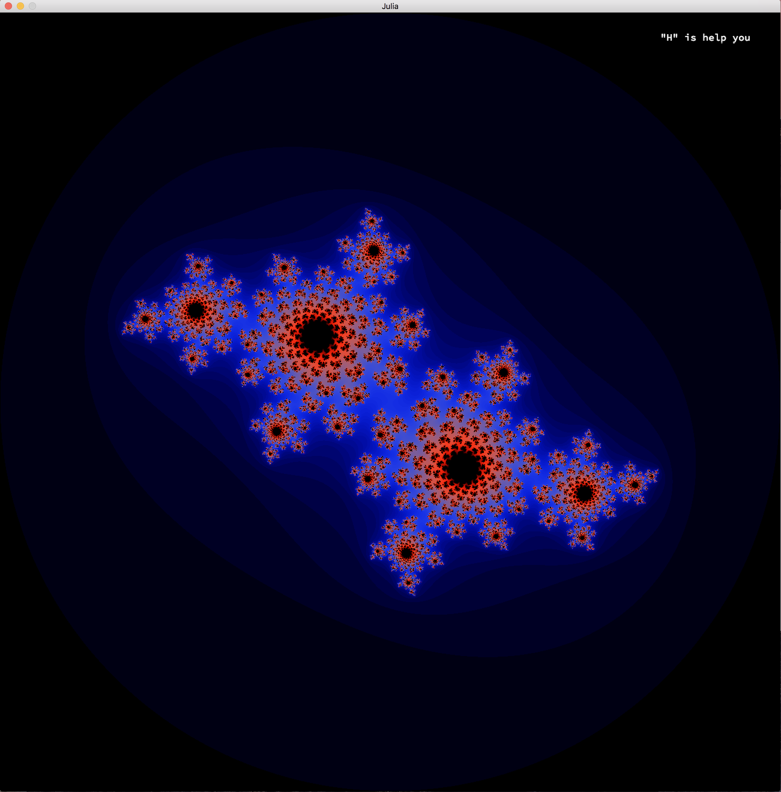
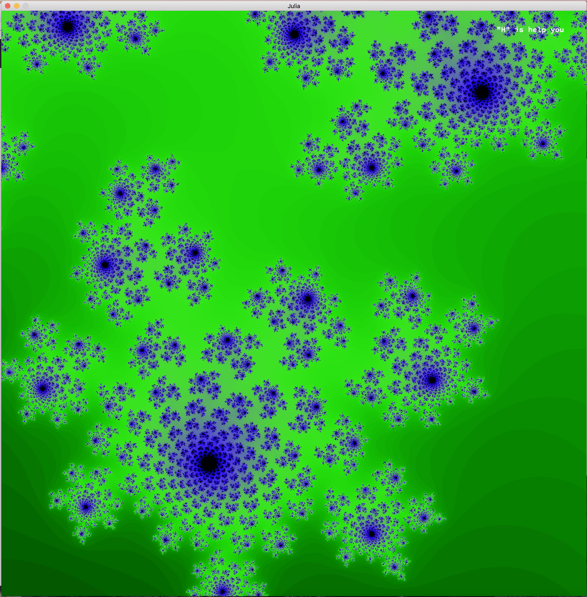

Fractol
--------------------------------------------

Fractol is a project aimed at exploring fractals, mathematical sets that exhibit a repeating pattern displayed at every scale.


## Features

Multiple fractals : 
  - Mandelbrot;
  - Julia;
  - Mandelbar;
  - Celtic Mandelbrot;
  - Perpendicular Mandelbrot.

Increase and decrease max iteration for shape calculation.
Zoom and unzoom.
Different colors patterns.

## How to use ?

```
$> make
$> ./fractol fractol_name
```

## Pictures
### Mandelbrot




### Julia



